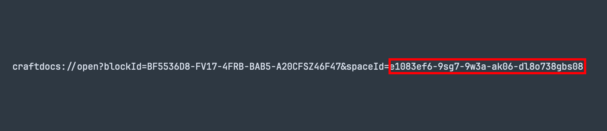
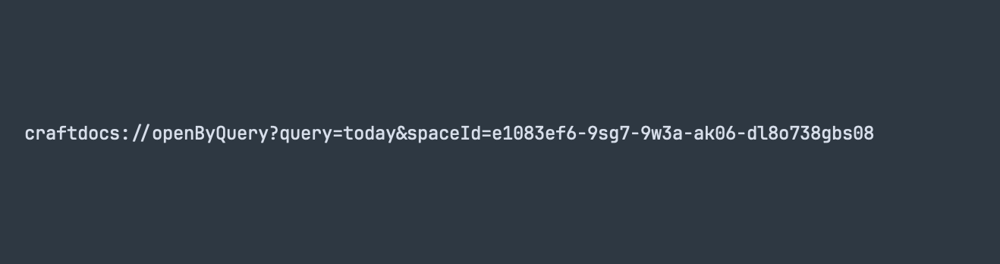
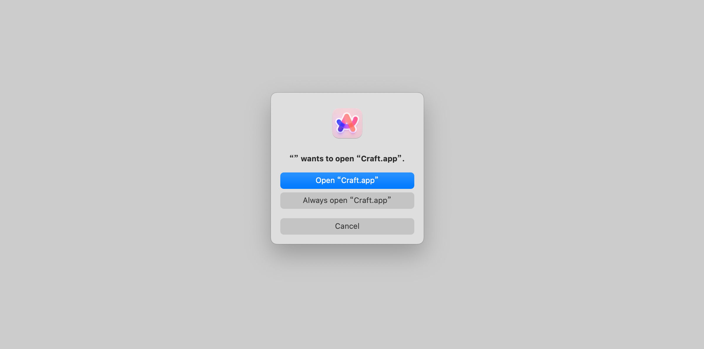
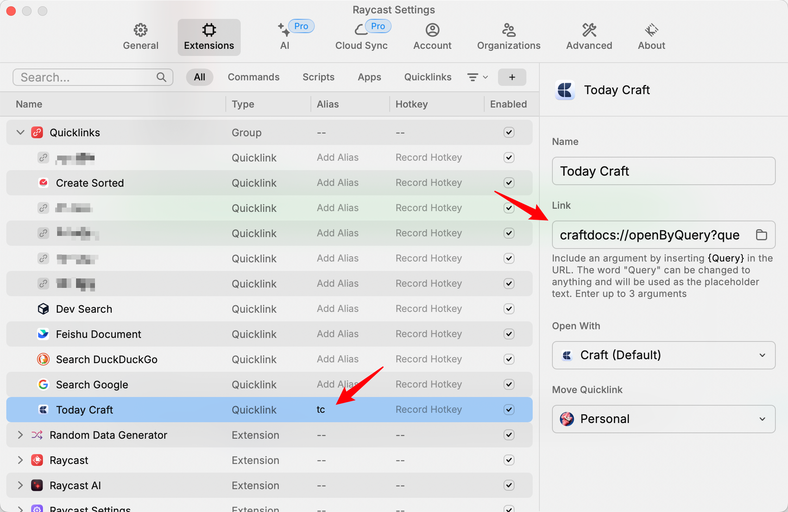

在 [Craft Help Center](https://support.craft.do/hc/en-us/articles/360020168838-Using-URL-Scheme) 可以查看 Craft 支持的所有 URL Scheme 方案。本文只分享其中「Access to Daily Notes」相关的内容。

> **Access to Daily Notes**
> - **Yesterday** - craftdocs://openByQuery?query=yesterday&spaceId=<spaceId>
> - **Today** - craftdocs://openByQuery?query=today&spaceId=<spaceId>
> - **Tomorrow** - craftdocs://openByQuery?query=tomorrow&spaceId=<spaceId>

以上是 Craft 提供的支持快速打开 Craft Daily Note 的 URL Scheme，3 个 URL Scheme 的区别仅仅在于打开的 Daily Note 是昨天、今天还是明天。

## 配置 URL Scheme 参数

所有 URL Scheme 都需要提供一个 `spaceId` 参数，这个参数可以在 Craft 中任意一篇文档的 Deeplink 中获得。关于 Craft Deeplink 的介绍可以在 [Craft Help Center](https://support.craft.do/hc/en-us/articles/360020043878-How-to-link-into-a-specific-place-in-Craft-with-a-Deeplink) 查看。

获取 Deeplink 路径/方法：

1. 打卡任意一篇文档
2. 点击「Share」
3. 点击「Export as」
4. 点击「Advanced」
5. 点击「Copy Deeplink」

将复制到的 Deeplink 粘贴到某个文本编辑器，可以看到如下内容，其中 `spaceId=` 后面的内容就是我们需要的 `spaceId` 参数。

⚠️ 注意：是 `spaceId=` 之后的内容，不包括 `spaceId=` 这几个字符。

以打开 Today Daily Note 为例，使用上面获取到的 Deeplink 中的 spaceId 替换 Craft 提供的 URL Scheme 中的 `<spaceId>` ，结果如下：

⚠️ 注意：是将 `<spaceId>` 完整替换掉，包括 `<` 、`>` 这样的字符。

这就是一段完整的、可用的 URL Scheme，现在只需要访问该 URL（就像访问 [https://www.rokcso.com](https://www.rokcso.com) 一样）就能直接打开 Craft Today Daily Note。比如直接在浏览器地址栏输入该 URL 然后回车。

## 快速访问 URL

为了让访问该 URL 这个动作更便捷，我使用 Raycast 的 Quicklinks 功能，配置一个名为「Today Craft」的 Quicklink 来快捷访问该 URL，并给该 Quicklink 配置了一个别名（Alias）。

**最终效果**：不论在任何 App、任何窗口、任何页面中，只需唤起 Raycast 然后输入「tc」，点击回车，即可直达 Craft Today Daily Note。

注：如果给 Today Craft 这个 Quicklink 配置一个快捷键，那么不论在任何 App、任何窗口、任何页面中，只需要按下该快捷键，即可直达 Craft Today Daily Note。

