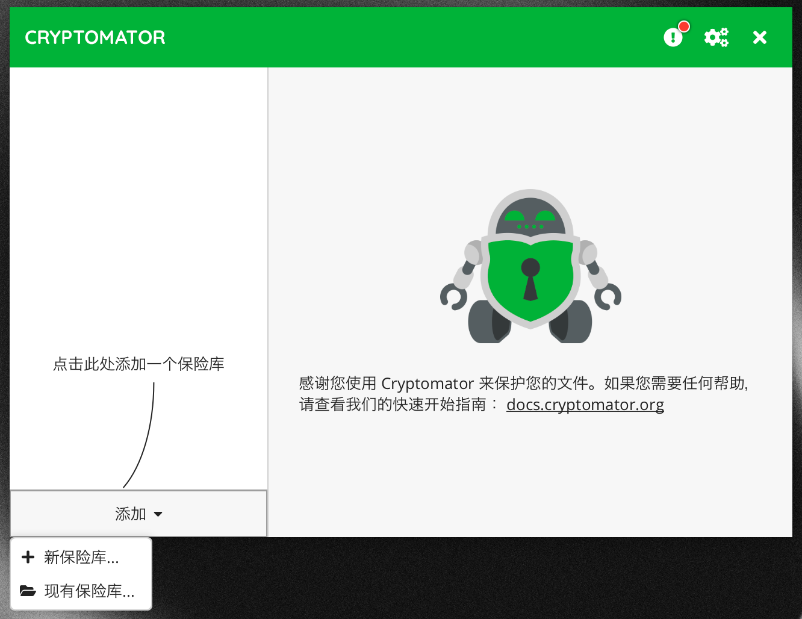
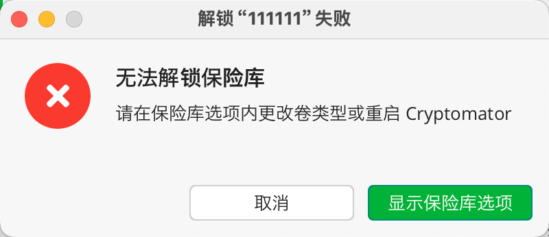
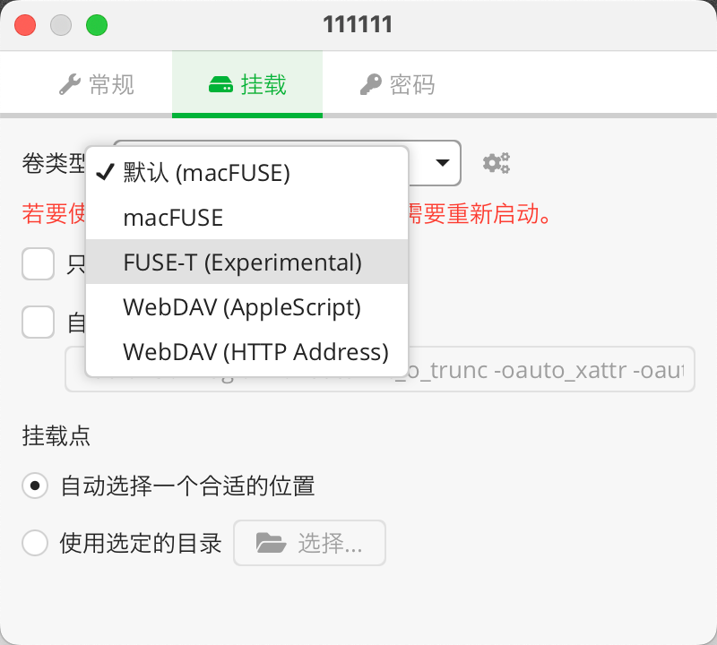
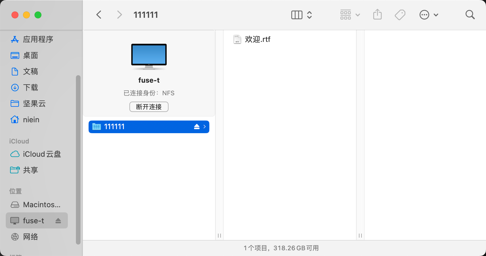

[Cryptomator](https://cryptomator.org/) 是一个**开源**的数据加密程序，主要用于将云同步的数据进行加密以保护数据安全，当然不进行云同步的数据也可以使用其进行加密。

云同步或者云数据存储服务提供的数据加密通常只是对本地到云端的传输过程进行加密，已经传输到云服务的数据本质上是可以被有权限的用户随意访问的。

Cryptomator 可以创建一个文件夹然后对该文件夹进行加密，该文件夹可以看作一个加密仓库，对于有保密需求的文件可以放入该文件夹后将该文件夹上传至云服务。

## 安装 Crytomator 以及 FUSE-T

Crytomator 针对 macOS 系统提供了 Intel 芯片和 M 芯片版本的程序，而不同芯片版本的程序都还需要安装不同的文件系统框架。Crytomator 会基于文件系统框架来进行一系列自定义文件系统操作，以实现文件加密。

而对于 Intel 芯片，需要使用 [macFUSE](https://osxfuse.github.io/) 框架，M 芯片则使用 [FUSE-T](https://www.fuse-t.org/) 框架。

> 我的设备是 M 芯片，后文基于该条件演示。

推荐使用 [Homebrew](https://brew.sh/) 安装 FUSE-T，安装命令：

```bash
brew install macos-fuse-t/homebrew-cask/fuse-t
```

安装好文件系统框架后下载、安装 Crytomator，打开 Crytomator 选择「添加」-「新保险库」。



随后根据提示输入保险库名称、存储位置（可以选择云同步服务的本地同步文件夹）、设置密码（生成恢复密钥）。

至此这个加密保险库就已经创建完成，然后可以使用刚刚设置的密码来打开密码库。此时可能会报错：



根据提示，我们需要在「保险库选项」-「挂载」中修改卷类型，如果是 M 芯片需要修改为 FUSE-T 类型（并且需要安装 FUSE-T 文件系统框架）。



然后重启 Crytomator 后重新尝试解锁保险库，即可解锁成功。

解锁成功后进入 Finder 即可看到挂载成功的保险库（效果类似于插入了一个 U 盘），所有放入该保险库的文件都会被加密。

