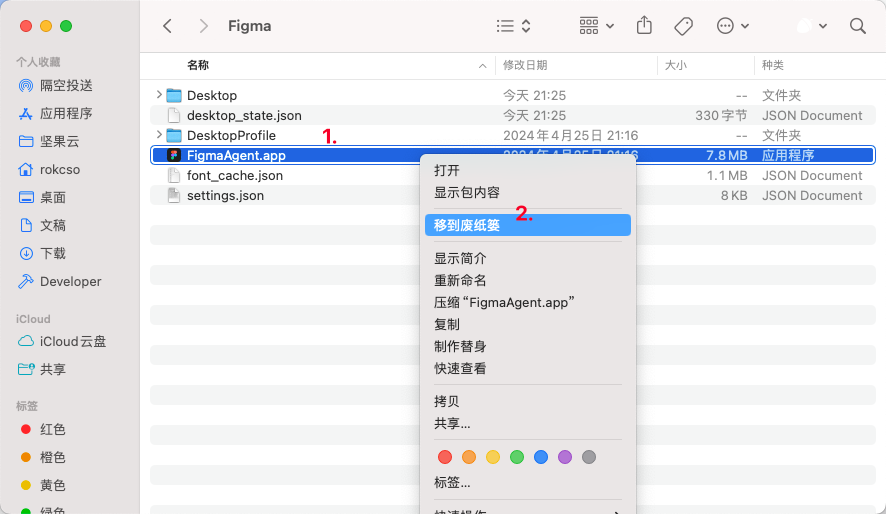

> 我的 macOS 版本：Sonoma 14.5

在使用 Figma macOS 客户端时，总有一个 FigmaAgent.app 被自动添加到登录项，即使在「系统设置 - 通用 - 登录项」中手动删除该项目，再次打开 Figma 依然会自动添加，这很烦人。😡

## 解决方案

1. 打开「活动监视器」，找到 FigmaAgent，选中后点击「停止（退出）」后选择「强制退出」。

2. 访问「系统设置 - 通用 - 登录项」，删除 FigmaAgent.app。
3. 打开「访达」，进入 `~/Library/Application Support/Figma` 文件夹，删除 FigmaAgent.app。

4. 打开「访达」，进入 `/Applications/Figma.app/Contents/Library` 文件夹，删除 FigmaAgent.app。

完成！✅

