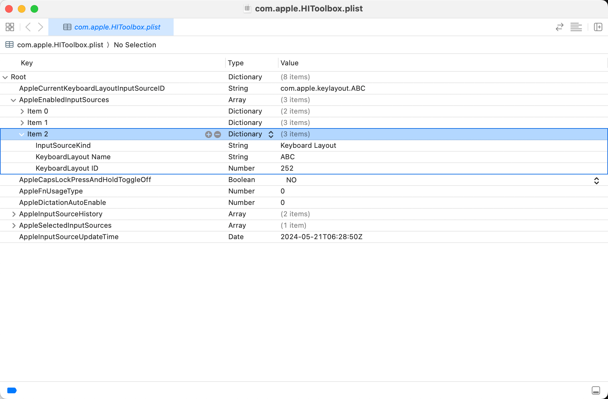

> 以下操作均在 macOS Sonoma 14.3 上进行，不确定其他 macOS 系统是否适用。
> 但看网上文章即使是其他 macOS 系统大多也都成功了。

原理：要删除 macOS 自带的 ABC 输入法，本质上就是要删除对应的配置。

macOS 的配置文件基本都是以 `.plist` 为后缀的文件，而输入法相关的配置都存储在 `com.apple.HIToolbox.plist` 这个系统配置文件中，该配置文件主要负责存储与用户界面相关的配置，比如：输入设备、键盘布局、鼠标设置、触控板手势等等。

💡 提示：打开/修改 `.plist` 文件需要使用 Xcode 或者 PlistEdit Pro 软件。

⚠️ 注意：通常不建议普通用户随意修改系统 `.plist` 文件，这可能会影响系统的稳定性和安全性。

## 关闭/开启 SIP

在修改系统配置文件之前，需要先关闭系统完整性保护（SIP），SIP 的主要目的是保护系统文件和目录，防止它们被未经授权的修改，这种保护措施甚至对 Root 用户也有效。

⚠️ 注意：SIP 默认开启，如需关闭 SIP 以修改一些系统配置文件，也非常建议完成修改之后重启 SIP。

**如何确定是否已经关闭/开启 SIP？**

打开终端，输入 `csrutil status` 命令，回车执行该命令，终端将显示一条消息来提示 SIP 状态，比如：`System Integrity Protection status: enabled` 。

**关闭/开启 SIP 的详细步骤：**

1. 重启 Mac，重启过程中持续按住 `Command + R` ，进入恢复模式
2. 进入恢复模式后，打开终端（路径：顶部菜单栏 - 实用工具 - 终端）
3. 输入 `csrutil disable` 命令，回车执行该命令

完成步骤 3 后，如果一切正常，终端将显示一条消息来提示 SIP 已经禁用，并提示重启 Mac，根据提示操作即可。

开启 SIP 的步骤和关闭非常类似，仅在步骤 3 时，输入 `csrutil enable` 命令，回车执行该命令。如果一切正常，终端将显示一条消息来提示 SIP 已经启用，并提示重启 Mac，根据提示操作即可。

## 修改配置文件以删除 ABC 输入法

输入法相关的系统配置文件 `com.apple.HIToolbox.plist` 在 👇 这个路径下，可以打开 Finder 按下 `Commans + Shift + G` 输入（复制粘贴）该路径，回车，然后将该文件拖入 Xcode（或者使用 Xcode 选择打开）。

```plaintext
~/Library/Preferences/com.apple.HIToolbox.plist
```

也可以直接在终端执行以下命令（可能会要求输入密码，即 Mac 开机密码，输入的字符不可见），都可以打开该配置文件。

```bash
sudo open ~/Library/Preferences/com.apple.HIToolbox.plist
```

成功（正常）打开后的配置文件如下图，在 Root - AppleEnabledInputSources 下有一系列 Item，找到 KeyboardLayout Name = ABC 的 Item（比如下图中的 Item 2），将该 Item 完整删除（比如完整选中 Item 2 后点击删除）。



删除完成后保存（`Command + S`）该配置文件，随后重启 Mac 即可。

## 添加 ABC 输入法

如果要重新将 ABC 输入法添加回来，只需要进入「系统设置 - 键盘 - 输入法」点击 + 号，选择「英语 - ABC」点击「添加」即可。

