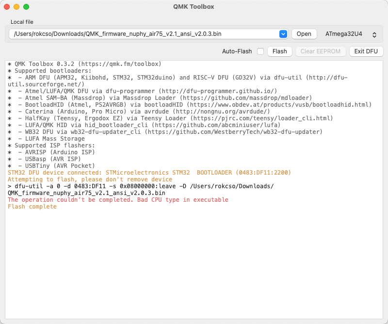
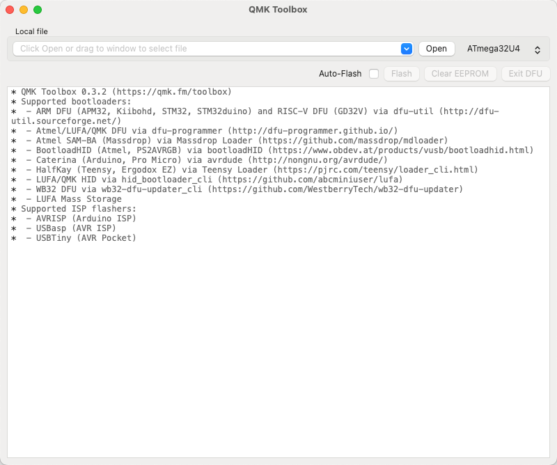
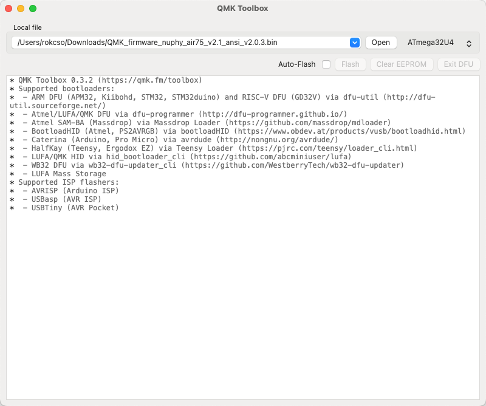
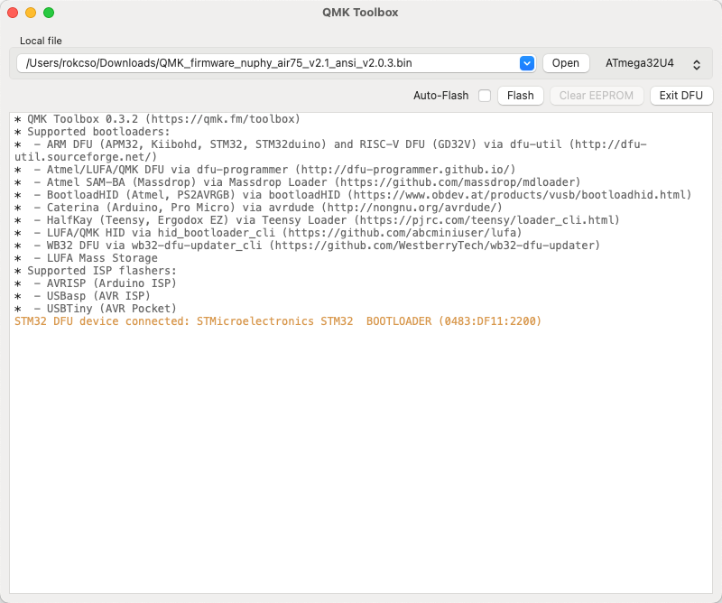
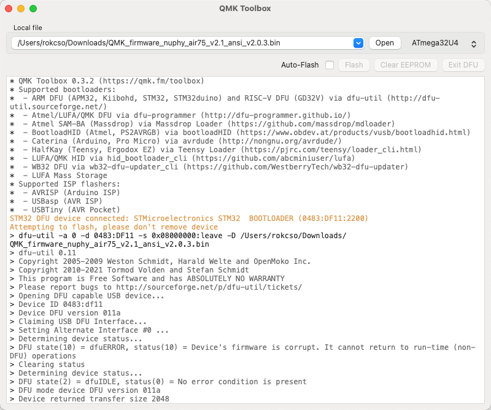
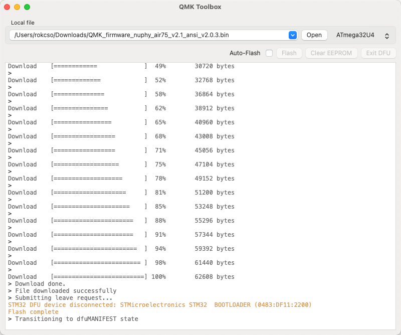

## 使用手册

在线版本：[NuPhy Air75 V2 Quick Guide](https://cdn.shopify.com/s/files/1/0268/7297/1373/files/NuPhy_Air75_V2_Quick_Guide.pdf?v=1696498123)

PDF 文件：

[NuPhy_Air75_V2_Quick_Guide.pdf](https://res.craft.do/user/full/e9983e66-9ce7-993a-ad36-dd817783b2b8/doc/BFC1BDA6-E7C9-4C83-9F50-404CCF177E6F/0E45A28A-42AE-4A5B-86BE-8C8E4B901979_2/lSkGpxqEst7cyCttPjsyWbTpZza6FwWKTySMxrGO0Msz/NuPhy_Air75_V2_Quick_Guide.pdf)

## 常见问题 😅

### 设备连接/切换

关于无限连接切换设备、蓝牙匹配、2.4G 连接等操作，使用 FN 键加**::数字键::** 1~4，而不是 FN 键加 F1～F4。

### 键盘自动休眠模式

开启键盘自动休眠模式后，若键盘连续 6 分钟没有任何操作，将进入休眠模式（键盘背光关闭）。

注：自动休眠时间默认 6 分钟，暂时不清楚如何自定义这个自动休眠时间。

使用快捷键 `FN + ]` 开关键盘自动休眠模式，按下 `FN + ]` 后，如果键盘右上角 RGB 灯条闪烁 3 次红灯，意味着关闭自动休眠模式，如果闪烁 3 次绿灯，意味着开启自动休眠模式。

## 更新固件

### 准备

1. 安装 QMK Toolbox

前往 [GitHub QMK Toolbox 仓库](https://github.com/qmk/qmk_toolbox) 下载对应操作系统的软件。

macOS 可以使用 Homebrew 进行安装：

```bash
brew install qmk-toolbox
```

⚠️ 注意：QMK Toolbox 似乎还没有专门为 M 芯片（ARM 架构）的 Mac 提供适配。

我的 M1 Mac 使用 Homebrew 安装的 QMK Toolbox 在后续 Flash 固件时会提示 `The operation couldn’t be completed. Bad CPU type in executable` ，最终固件更新失败。



而通过 QMK Toolbox Installer 安装的 QMK Toolbox 则能成功 Flash 固件，不会提示 CPU 类型异常。 可能是由于 M 芯片的 Mac 在通过 QMK Toolbox Installer 安装 Intel 程序时会要求安装 Rosetta，而 Rosetta 可以让 Intel 程序在 M 芯片上更好的运行。

2. 下载固件

前往 [Nuphy 固件发布页面](https://nuphy.com/pages/qmk-firmwares) 下载对应键盘型号的固件。注：固件文件后缀为 `.bin` 。

### 更新

1. 打开 QMK Toolbox



2. 点击「Open」选择已下载好的固件文件



3. 将 Nuphy Air75 V2 切换到有线连接模式，按住 ESC 键然后再插入 USB-C 以连接键盘和电脑

⚠️ 注意：这一步操作的顺序非常重要，先断开键盘和电脑的连接，然后按住 ESC 键的同时插入 USB-C 来连接键盘和电脑。

当 QMK Toolbox 显示如图中黄色文本（提示设备已连接）时则意味着键盘已经成功连接。



4. 点击「Flash」开始更新固件

⚠️ 注意：更新的过程中千万、一定、绝对不要断开键盘和电脑的有线连接。

如果一切正常，QMK Toolbox 会开始执行一系列 Erase 和 Download，当固件更新完成，QMK Toolbox 会主动断开和键盘的连接。

当 QMK Toolbox 显示如图中最后一行黄色文本（Flash complete）即意味着固件更新完成。





# 使用 VIA 配置键盘

> Link: [https://nuphy.com/pages/via-usage-guide-for-nuphy-keyboards](https://nuphy.com/pages/via-usage-guide-for-nuphy-keyboards)

